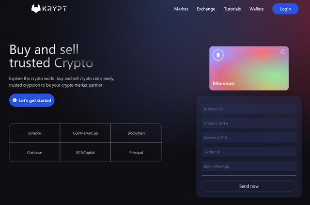

# Krypt - Web 3.0 Blockchain Application



## Built with

<p>
  <a href='https://www.react.org/'>
		
	</a>
  &nbsp;
  <a href='https://www.typescriptlang.org/'>
    
  </a>
  &nbsp;
  <a href='https://tailwindcss.com/'>
    
  </a>
  &nbsp;
  <a href='https://docs.soliditylang.org/en/v0.8.6/index.html'>
    
  </a>
  &nbsp;
  <a href='https://ethereum.org/en/developers/docs/'>
    
  </a>
  &nbsp;
</p>


# Available Scripts

- Clone the repo

  ```bash
  $ git clone https://github.com/francislagares/krypt-blockchain-app.git
  ```

- Install the dependencies by running the following command.

  ```bash
  yarn install
  ```

- Start the development server:

  ```bash
  yarn start
  ```

- Start the test suites:

  ```bash
  yarn test
  ```

# Author


Created by [@francislagares](https://www.linkedin.com/in/francislagares/) - feel free to contact me!
* 